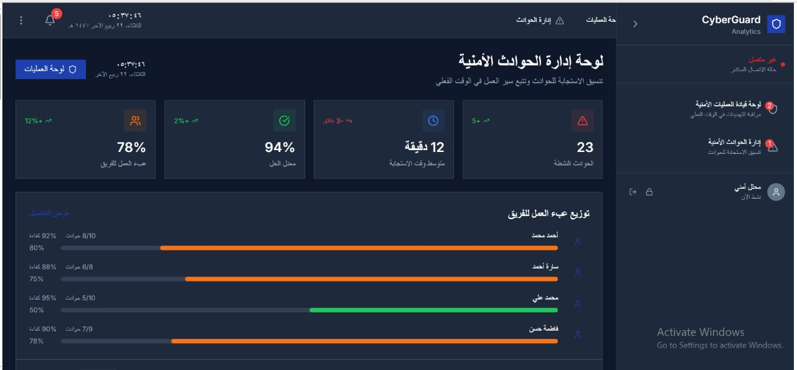
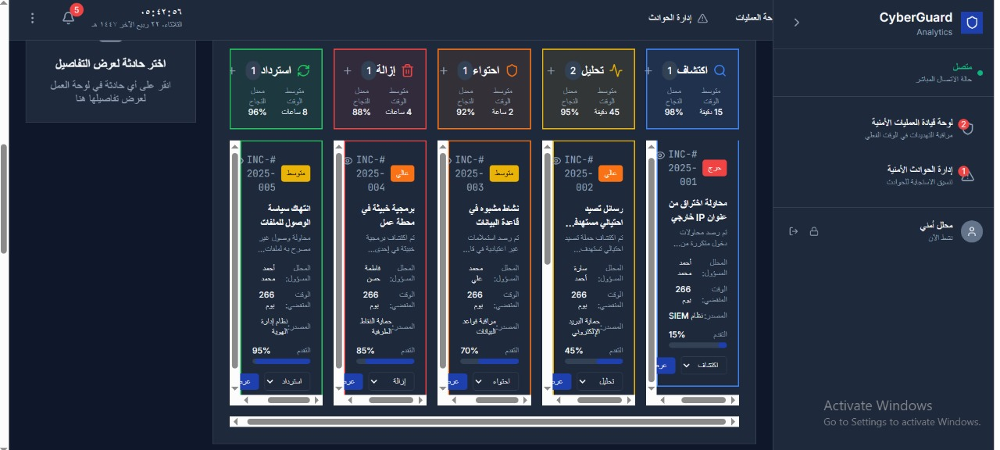
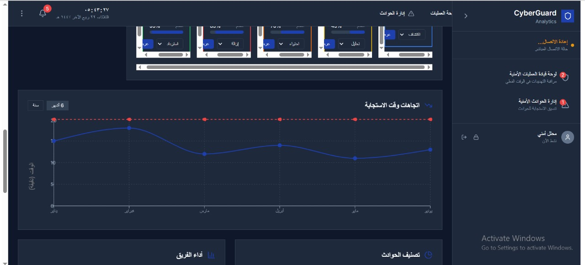
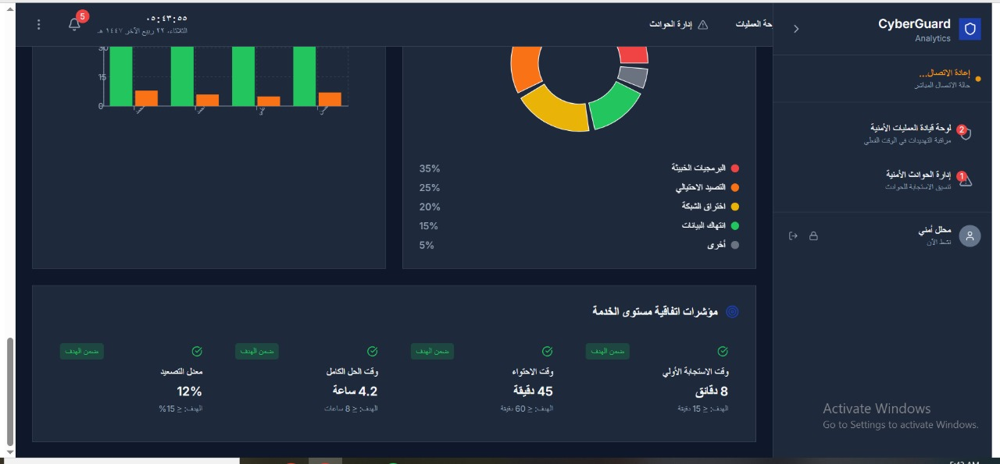
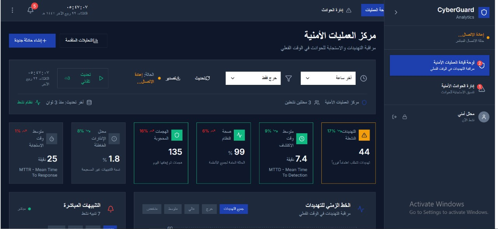
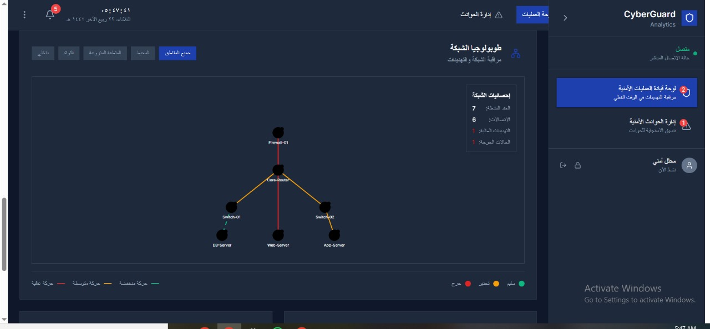
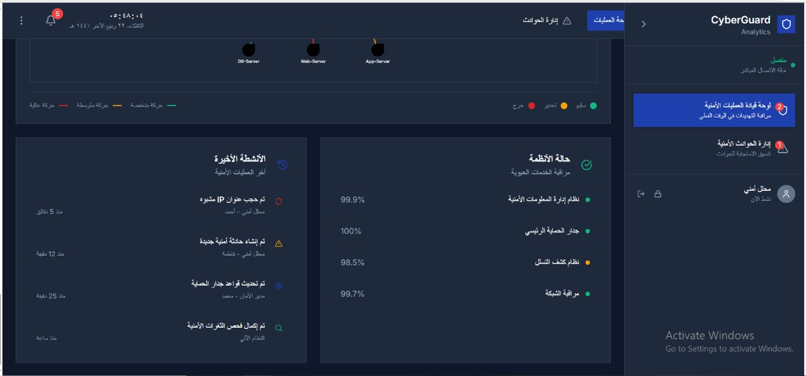
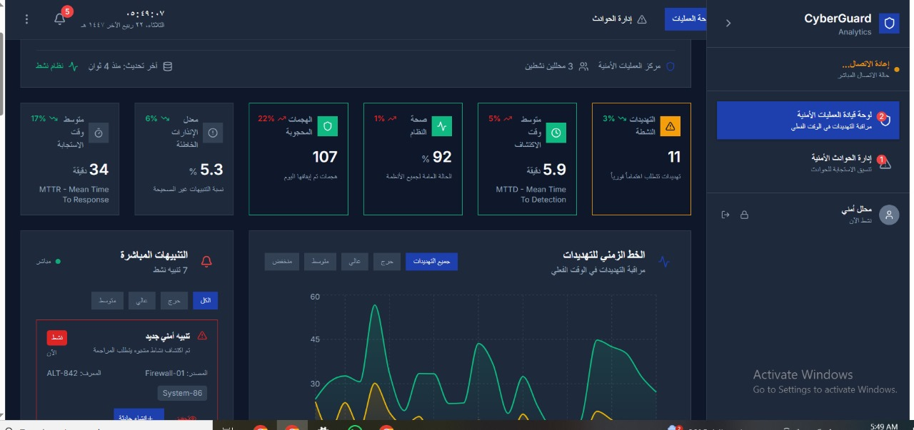

# 🛡️ توثيق لوحات التحكم - CyberGuard 2025  
# 🛡️ CyberGuard 2025 Dashboard Documentation

هذا الملف يعرض مجموعة من الواجهات الرسومية الخاصة بمنصة CyberGuard Analytics، والتي تم تطويرها لمراقبة وتحليل الحوادث الأمنية، التهديدات السيبرانية، وأداء النظام بشكل لحظي.  
This file presents a collection of graphical interfaces from the CyberGuard Analytics platform, designed for real-time monitoring and analysis of security incidents, cyber threats, and system performance.

---

## 🔗 محتوى اللوحات | Dashboard Index

- [لوحة 01 / Dashboard 01](#لوحة-01-إدارة-الحوادث-الأمنية---المدارس-السيبرانية)
- [لوحة 02 / Dashboard 02](#لوحة-02-نظرة-عامة-على-الحوادث-الأمنية)
- [لوحة 03 / Dashboard 03](#لوحة-03-إدارة-الحوادث-حسب-الفرق)
- [لوحة 04 / Dashboard 04](#لوحة-04-حالة-التهديدات-حسب-السيطرة)
- [لوحة 05 / Dashboard 05](#لوحة-05-الهجمات-ذات-الخطورة-العالية)
- [لوحة 06 / Dashboard 06](#لوحة-06-توزيع-التهديدات-ومؤشرات-الأداء)
- [لوحة 07 / Dashboard 07](#لوحة-07-تنبيهات-الحماية-ونمط-التهديدات)
- [لوحة 08 / Dashboard 08](#لوحة-08-مركز-العمليات-الأمنية)
- [لوحة 09 / Dashboard 09](#لوحة-09-خريطة-الشبكة-الأمنية)

---

## 🖼️ لوحة 01: إدارة الحوادث الأمنية - المدارس السيبرانية  
## 🖼️ Dashboard 01: Incident Management – Cyber Schools

عربي:  
تعرض هذه اللوحة إحصائيات الحوادث الأمنية في بيئة تعليمية سيبرانية:
- نسبة الحوادث المغلقة: 78%
- نسبة الحوادث المفتوحة: 94%
- عدد الحوادث المغلقة: 12
- عدد الحوادث المفتوحة: 23  
توزيع الحوادث حسب النوع: البرمجيات الخبيثة، التصيد الاحتيالي، الوصول غير المصرح به.

English:  
This dashboard displays incident statistics in a cyber-educational environment:
- Closed incidents: 78%
- Open incidents: 94%
- Total closed: 12
- Total open: 23  
Incident types include: Malware, Phishing, Unauthorized Access.

---

## 🖼️ لوحة 02: نظرة عامة على الحوادث الأمنية  
## 🖼️ Dashboard 02: Security Incident Overview

عربي:  
- عدد الحوادث: 107  
- الحوادث المغلقة: 92  
- الحوادث النشطة: 11  
- متوسط وقت الاستجابة: 34 ثانية  
تشمل رسمًا بيانيًا زمنيًا لتوزيع الحوادث.

English:  
- Total incidents: 107  
- Closed: 92  
- Active: 11  
- Mean Time to Response: 34 seconds  
Includes a time-based incident distribution chart.

---

## 🖼️ لوحة 03: إدارة الحوادث حسب الفرق  
## 🖼️ Dashboard 03: Incident Distribution by Teams

عربي:  
نسبة الاستجابة: 78%  
نسبة الحل: 94%  
متوسط وقت الاستجابة: 12 دقيقة  
توزيع الحوادث حسب الفرق: الدعم، الشبكات، الحماية، التطبيقات.

English:  
Response rate: 78%  
Resolution rate: 94%  
Average response time: 12 minutes  
Incidents distributed across: Support, Network, Security, Applications teams.

---

## 🖼️ لوحة 04: حالة التهديدات حسب السيطرة  
## 🖼️ Dashboard 04: Threat Status by Control Level

عربي:  
5 حالات تهديد: تم السيطرة، لم يتم السيطرة، تحليل، تحت المراقبة، مكتشف.  
كل حالة تعرض عدد المحاولات، الأجهزة، المستخدمين، ونسب النجاح والفشل.

English:  
Five threat states: Controlled, Uncontrolled, Under Analysis, Monitored, Detected.  
Each panel shows attempts, devices, users, and success/failure rates.

---

## 🖼️ لوحة 05: الهجمات ذات الخطورة العالية  
## 🖼️ Dashboard 05: High-Risk Attack Trends

عربي:  
رسم بياني يوضح عدد الهجمات خلال أيام الأسبوع، مع خط أحمر للحد الأعلى وخط أزرق للبيانات الفعلية.

English:  
Graph showing attack counts across weekdays, with a red threshold line and blue actual data line.

---

## 🖼️ لوحة 06: توزيع التهديدات ومؤشرات الأداء  
## 🖼️ Dashboard 06: Threat Distribution & Performance Indicators

عربي:  
- نسبة الحماية: 12%  
- معدل التهديدات اليومية: 4.2  
- عدد الأجهزة المتأثرة: 8  
يشمل رسم شريطي ومخطط دائري لتوزيع التهديدات.

English:  
- Protection rate: 12%  
- Daily threat rate: 4.2  
- Affected devices: 8  
Includes bar and pie charts for threat distribution.

---

## 🖼️ لوحة 07: تنبيهات الحماية ونمط التهديدات  
## 🖼️ Dashboard 07: Protection Alerts & Threat Patterns

عربي:  
تنبيهات مصنفة حسب الأهمية، مع رسم بياني لنمط التهديدات عبر الزمن.

English:  
Alerts categorized by severity, with a line graph showing threat patterns over time.

---

## 🖼️ لوحة 08: مركز العمليات الأمنية  
## 🖼️ Dashboard 08: Security Operations Center

عربي:  
- عدد الحوادث: 135  
- الحوادث المغلقة: 99  
- الحوادث المفتوحة: 44  
- MTTR: 25 ثانية | MTTD: 7.4 ثانية

English:  
- Total incidents: 135  
- Closed: 99  
- Open: 44  
- MTTR: 25 sec | MTTD: 7.4 sec

---

## 🖼️ لوحة 09: خريطة الشبكة الأمنية  
## 🖼️ Dashboard 09: Network Security Map

عربي:  
رسم توضيحي لعناصر الشبكة: Firewall متصل بـ Web, Mail, App Servers، وجميعهم مرتبطين بـ Switch 01.

English:  
Visual map of network components: Firewall connected to Web, Mail, App Servers, all linked to Switch 01.

---

## 🎯 الهدف من هذه اللوحات | Purpose of These Dashboards

تم تصميم هذه الواجهات لتوفير رؤية تشغيلية متكاملة لفِرق الأمن السيبراني، سواء في بيئات تعليمية أو مؤسسية.  
Each dashboard is tailored to deliver actionable insights for cybersecurity teams, enabling faster response, clearer threat categorization, and smarter decision-making.

---

## ✍️ توقيع المطور | Developer Signature

تم تطوير هذه اللوحات بواسطة علاء محمود محمد، مطور مستقل في مجال الأمن السيبراني، متخصص في بناء أدوات تحليل ذكية ومحترمة للخصوصية.  
These dashboards were developed by Alaa Mahmoud Mohamed, an independent cybersecurity developer specializing in privacy-respecting analytics tools.

---
